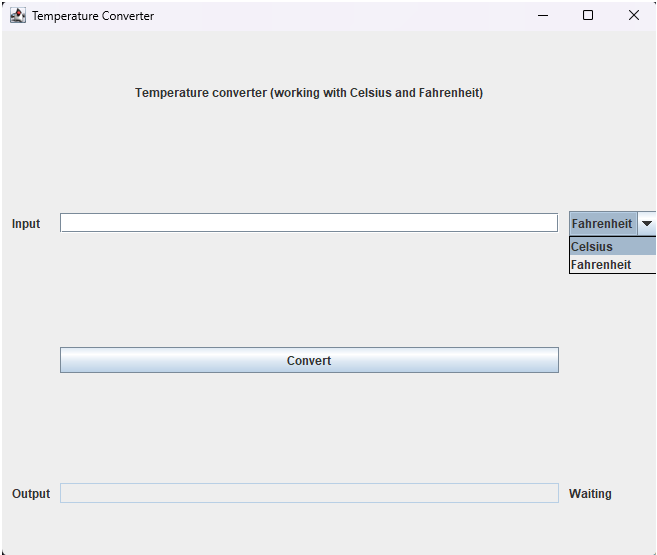
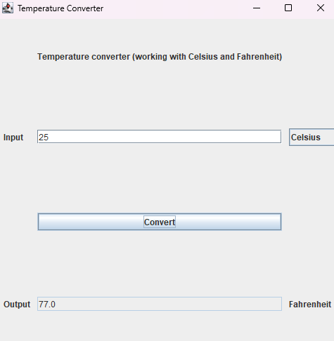
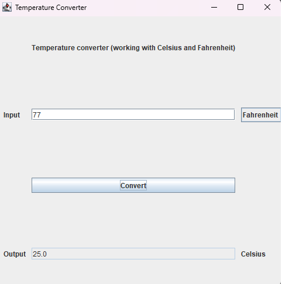

# Temperature convertor

This project is a simple temperature convertor using the GUI Form in IntelliJ.

## Table of Contents

- [Installation](#installation)
- [Usage](#usage)

## Instalation

1. Clone the repository and open it using IntelliJ.

## Usage

1. Run temperatureConvertor main class.
2. Select the temperature unit from the drop down list next to the input. Add the desired temperature and press the "Convert" button.

3. You will get the result in the outcome area, and the label will adjust accordingly.

